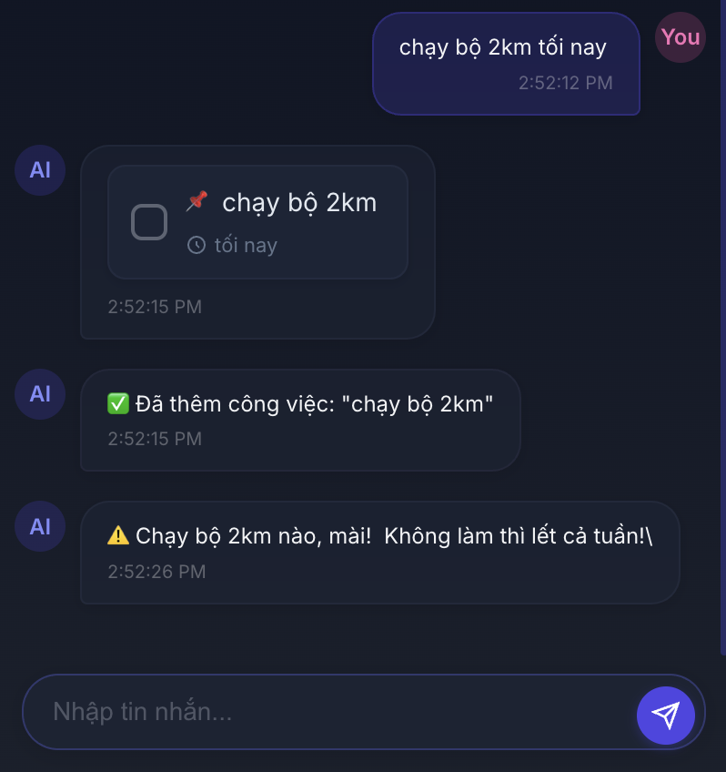
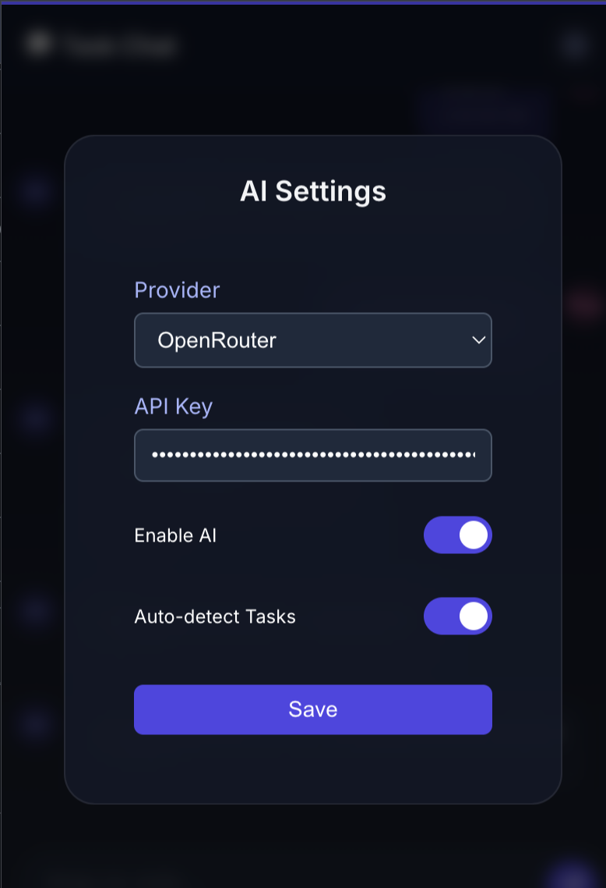

# TaskTroll

<div align="center">
  
TaskTroll Logo

**A smart todo list with an AI coach that helps keep you accountable**

</div>

## ✨ Overview

TaskTroll is a Chrome extension that combines a modern todo list manager with AI-powered coaching to help you stay on track with your tasks. Unlike ordinary todo apps, TaskTroll uses natural language processing to detect tasks from your conversations and provides gentle reminders when deadlines approach.

## 🚀 Features

- **Smart Task Detection** - Automatically identifies tasks from your chat messages
- **Intelligent Due Dates** - Understands natural language references to time and dates
- **AI Coaching** - Provides personalized reminders when tasks are overdue
- **Category Organization** - Automatically categorizes tasks for better organization
- **Clean Interface** - Modern, distraction-free UI designed for productivity
- **Multiple AI Providers** - Support for OpenAI, Gemini, DeepSeek and OpenRouter

## 📸 Screenshots

<div align="center">

### Main Chat Interface
TaskTroll automatically detects tasks from natural language and creates trackable items.



### AI Configuration
Connect to your preferred AI provider to enable smart task detection and coaching.



</div>

## 🛠️ Installation

### Development Build

```bash
# Clone the repository
git clone https://github.com/yourusername/tasktroll.git
cd tasktroll

# Install dependencies
npm install

# Run in development mode
npm run dev
```

### Loading the Extension

1. Build the extension using `npm run build`
2. Open Chrome and navigate to chrome://extensions/
3. Enable "Developer mode"
4. Click "Load unpacked"
5. Select the `dist` folder from this project 
